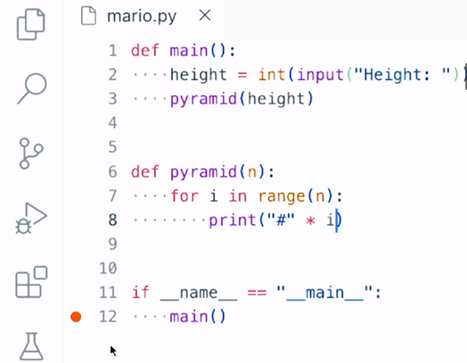
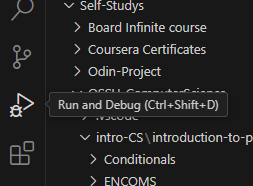
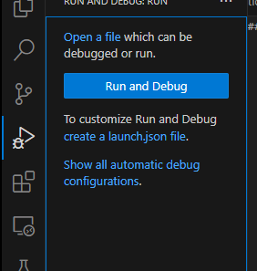
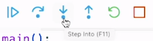
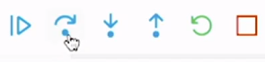

# Topic: Debugging

# link:

## Debugging:
The chore of search and eliminate the problems a code may have.

## Debugging Tools:

### Using print:
we can temporarily, but pretty easily display the values of variables or other things in your program. Just so you can help see what the computer sees underneath the hood.

Cons: If the program is too big and there is too many prints, may create a mess and need to figure out where that print comes from and delete them all at the end.

### Text/IDE debuggers:

#### breakpoints
A breakpoint is simply a mechanism when using a text editor or an IDE that allows you to specify on what line or what lines of code do you want to pause or break execution of the program. just so you can start poking around at that line of code.

in this example is indicate to the debugger to do the breakpoint when we call main function.

- step into let us dive into main executing and pause in the first iteration. mostly use if is your function and you need to execute it.

- step over let us execute that line of code but not dive in. mostly use to skip functions that are already working or is from the own language functions.
