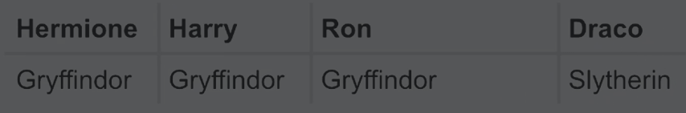

## Topic: Loops

## link: https://learning.edx.org/course/course-v1:HarvardX+CS50P+Python/block-v1:HarvardX+CS50P+Python+type@sequential+block@59c86cd0b84f463d814d6fd46a2c7eea/block-v1:HarvardX+CS50P+Python+type@vertical+block@00da873aabe24f3a987db3a805869ce2

## Loops: 
Give us the ability to do something again and again.

```
#First interaction, not optimize, poorly design:
print("meow")
print("meow")
print("meow")
```
Notes:
- Is a bad habit to "Repeat ourself" in our code.
- What if you need multiple times or need to change the question. This make this solution inviable in the long run.

While:
Allows us to ask a question again and again.

We need to create the variable that control o valid or question, and we need a way to make this variable reach one point it which will result in true or false.

If we don't set a limit on our while loop, the loop will never end.

ctlr + c to end a infinite loop or current process.

```python
#Second interaction, not optimize but works:
i = 3
while i != 0:
    print("meow")
    i = i - 1 #if we don't add a control for our loop, will continue forever. In this case it will decrease the valor of i
```

```
#Third interaction, not optimize, poorly design:
i = 0
while i < 3: #in this case we don't use the less or equal, since we don't want it to reach 3, only less than 3.
    print("meow")
    i += 1 #In this case instead of i = i + 1 we gonna use a special syntax, popular in code.

#Note: in other languages it can be ++ or -- but is different in python
```

another loop "for"

For
This works better with list. is another data type that allows us to store things in it, values, objects, other lists.

It allow you to iterate over a list of items.

a list: [value1, value2,value3]

tip:
- The variable that we use "i" in the for, if we are not using it later we can change it for "_" this is something pythonic, it means we are using a variable for iteration but we don't care or use it later.

### first iteration, a poorly design for loop.

```
for i in [0,1,2]:
    print("meow")

#Since the list consist of 3 items, it prints 3 meows. But is poorly design as is a good habit to check for corner cases, to take to the extreme the code and see if functional and easy to use. Is poorly design as if the list is longer or too big, would be impractical to use.
```


### second iteration, some improvement to the design for loop.

```
for i in range(10): #instead of manually setting the list of values, we use a python function that will set our range of values to evaluate.
    print("meow")

#This improves over the last part. But we can improve a little more.
``` 


### Third iteration, more improvement to the design for loop using a pythonic solution.

```
for _ in range(10): #We change the variable that iterate to a _ in this case since we don't use or won't use the result of the iteration.
    print("meow")
```


### Fourth iteration, is a pythonic way in python to do something like the for, but is not that readable.

```
print("meow\n" * 3, end="")

#- we can do some iteration even if is a string, using multipliers, so is kinda like the for
#- we use the new line \n in the string to force a new line at the end.
#- we change the default end for a "" so there wont be an empty space.
```

## Note:
If we need to repeat a question many times because bad user input, we could induce a loop to always been True until we quit or the input is correct and the loop end the work imputed.

We can do this setting the condition for a infinity loop with:

while True:

This will always return true since the boolean is always evaluated as True, but we need to use this with care.

If we need it to ask the same question staying in the same loop, we use the keyword "continue"

If we need it to end the loop we use the keyword "break".

```
while True:
    n = int(input("What's n? "))
    if n > 0:
        break 

for _ in range (n)
    print("meow")
```
```
while True: #while this true always ask
    n = int(input("What's n? "))
    if n > 0: #if enter a value that is not, it will keep asking. If we enter an integer greater than 0, it will exit the loop.
        break #keyword for exit the loop

# Instead of asking if less than 0 and create more lines of code, we use a mutual opposition question, if greater than 0, break (stop the loop). This is common paradigm in python or any language.

for _ in range (n): #take our user input
    print("meow") #print as many n input
```

## List:
A list can contain different types of values

ex 
    listName = ["value1", "value2", "value3"]

A list have index position that start from 0 and is done opening a "[]" at the end of the variable to reach the item in that position.

ex 
    listName[2]

This would be equal to return "value3"

## first interaction
Is pretty lame since we have to hardcode the iterations.

```
students = ["Hermione", "Harry", "Ron"]
print(students[0])
print(students[1])
print(students[2])
```

## Second iteration
Ee can use a for loop, in this case using the control variable to hold one value of the list in each iteration, then print the value of that position.

```
students = ["Hermione", "Harry", "Ron"]

for student in students:
    print(student)
```

### Tip: 
- The name of the iteration variable cannot be in this case "_" since it would make the code too cryptic, as no one in the future would know you are referring to even you in the future.

- It would be good practice to place a name of the variable in plural, as to know it have many values in it. and the iteration value the same name but writing it in singular.

- In other languages, the variable for iteration need to be initialized, commonly 0. In python no.

## Third iteration
In this case we change the variable for the range function using the len function on the students list as to obtain the actual length of the list.

```

#the function len return the actual length of items a list hold. in this case 3
students = ["Hermione", "Harry", "Ron"]

#for iterate the list assigning the a value to i, for each item of the list.
for i in range(len(students)):
    print(i + 1, students[i])
```

## dict: 
Are a data structure that allows you to associate one value with another.

Literally like a dictionary in the human world.

They are different that a list since a list is a set of multiple values. But a dictionary is a two-dimensional human dictionary, a book. it associates something, with something else like words with their definitions.




### first iteration: very simple and not efficient and correct way to implement.

```
students = { 
    "Hermione: "Gryffindor", 
    "Harry: "Gryffindor", 
    "Ron": "Gryffindor, 
    "Draco", "Slytherin"
}

print("Hermione")
print("Harry")
print("Ron")
print("Draco")
```

Tips: 
- A key has to be an unique identifiers, the value could be the same on all.

# second iteration: much better since we are using a for to iterate the list, but since we are using the default construct of the for, we don't have much control of what or where iterate.

```
students = { 
    "Hermione": "Gryffindor", 
    "Harry": "Gryffindor", 
    "Ron": "Gryffindor", 
    "Draco": "Slytherin",
}

for student in students:
    print(student)
```

#### Notes:
- Like this we are only printing the keys, but not the content of each key.

### third iteration: in this we gonna access the diccionary with each key to obtain the house of each student name (key).

```
students = { 
    "Hermione": "Gryffindor", 
    "Harry": "Gryffindor", 
    "Ron": "Gryffindor", 
    "Draco": "Slytherin",
}

for student in students:
    print(student, students[student], sep=", ")
```

#### Notes:
- This way we can access using the key the content of the dictionaries, much like the index on a list.
- Since we need a separator, we can use the print parameter "sep" of separator so to print a ", " to separate the name and the house.

### fourth iteration: what if we work with more information about the students, we can create a list of dictionaries to help us keep the information organize, accessible and having the possibility of faster retrieval, this last is part of the major functions of python.

- first we create a list and inside the dictionaries

```
students = [
    {"name": "Hermione", "house": "Gryffindor", "patronus": "Otter"}, 
    {"name": "Harry", "house": "Gryffindor", "patronus": "Stag"}, 
    {"name": "Ron", "house": "Gryffindor", "patronus": "Jack Russell terrier"}, 
    {"name": "Draco", "house": "Slytherin", "patronus": None} #None is a keyword to indicate no value here. 
]

for student in students:
    print(student["name"], student["house"], student["patronus"], sep=", ")
```

#### Notes:
- we iterate each index of the list and dictionaries on that index, retrieve the information we want using the key values.
- we still use the sep=", " parameter to separate the outputs.

#### Tips:
- List of dictionaries let us store many dictionaries in indexed list.
- None is a keyword that literally means nothing.

## Creating patterns with Mario bricks

### Abstraction
Is a simplification of a potentially more complicated idea.

Advantage of the function
If you change the underlying of a implementation details, so long as you don't change the name, and the result is the same or better everything will work in your program.

### first iteration: simple but functional code:

def main():
    print_column(3)

def print_column(height):
    for i in height:
        print("#")

main()

### Notes: 
- We use a for in the function with a _ since we are not gonna use the variable in the iterations. 
- we use range() as to indicate the times it will iterate.

### second iteration: more simplistic using a pythonic convention.

```
def main():
    print_column(3)

def print_column(height):
    print("#\n" * height, end="")

main()
```

### Notes: 
- we can in python use a multiplier to indicate that the string should be printed X number of times 
- the end parameter indicates that in the end the space is omitted.

## Horizontal boxes!

### first iteration:

```
def main():
    print_row(4)


def print_row(width):
    print("?" * width)

main()
```

### note: - in this we use the same pythonic way of do things in python, but is more elegant and simple since it will print all in the same line.

# printing mario bricks in a wall.

### first iteration of printing bricks: is ok and works the same in many languages.

```
def main():
    print_square(3)


def print_square(size):
    for i in range(size):
        for j in range(size):
            print("#", end="")
        print()

main()
```

### second iteration: we can improve this even further using the pythonic tricks.

```
def main():
    print_square(3)


def print_square(size):
    for i in range(size):
        print("#" * size)

main()
```

### Note: 
- in this case it will print 3 times the brinks then the start again in another line and keep printing until the size is reach.


### Third iteration: we can even make abstraction of the problem (making it more smaller)

```
def main():
    print_square(3)


def print_square(size):
    for i in range(size):
        print_row(size)


def print_row(width):
    print("#" * width)


main()
```

### Note: 
- the program that calls a functions, don't care how the result is evaluated and return to him, it only wants the results.


