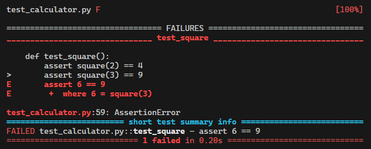
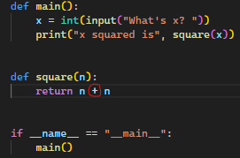
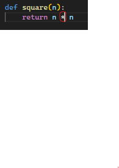
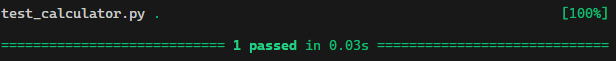
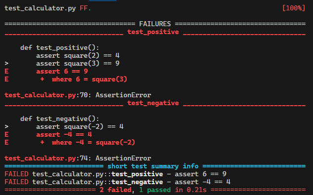
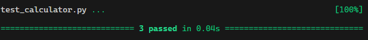
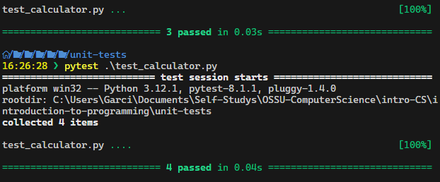

# Topic: Unit Tests

## [edx/introduction-to-programming-with-python/unit-tests](https://learning.edx.org/course/course-v1:HarvardX+CS50P+Python/block-v1:HarvardX+CS50P+Python+type@sequential+block@b9adc42a712943e798c96981fa2842f5/block-v1:HarvardX+CS50P+Python+type@vertical+block@7e7ce9b33f97430fae03a22b4433288e)

## Testing the code

As we start learning, we test our code creating inputs after inputs until we get the results we want, or we use external programs to test our code.

It's actually much better practice to get in the habit sooner than later of testing our code using code of your own. In other words, apart from creating the code of the program, create a little extra code to test the code that we write.

### ex-1

[calculator.py](./calculator.py?plain=1#L1)

We fill the file with the code needed to give us the result of the square of a number, in this case not necessarily including all corner cases.

```python
def main():
    x = int(input("What's x? "))
    print("x squared is", square(x))


def square(n):
    return n * n


if __name__ == "__main__":
    main()
```

📝 **Note:**

using:

```python
if __name__ == "__main__"
    main()
```

With this we make sure that if we use this file as a library, main is not just automatically called itself.

Now we are gonna create another program, that it sole purpose in life is to test the calculator program.

### ex-2

[test_calculator.py](./test_calculator.py?plain=1#L3)

```python
from calculator import square

def main():
    test_square()


def test_square():
    if square(2) != 4:
        print("2 squared was not 4") #this create a possible corner case if not correctly implemented the square function.
    if square(3) != 9:
        print("3 squared was not 9")

if __name__ == "__main__":
    main()
```

📝 **Note:**

using:

```python
from calculator import square
```

- With this we only import the function that we need to test our calculator program.

- There is another approach to do this, and is using another keyword named `assert`
  - Since if the code to test our program is bigger than the code that we are gonna test, is less likely that we gonna do it.
  - The less code we write, the less likely we are to make mistakes.

## assert

Assert is a keyword in python and some other languages as well that allow us to do exactly  that, as in English, to assert that something is true, to sort of boldly claim that something is true, and if it is, nothing's going to happen. No errors are going to appear on the screen, but if is not true, we gonna see an error message.

### ex-3

[test_calculator.py](./test_calculator.py?plain=1#L20)

```python
from calculator import square

def main():
    test_square()


def test_square():
    assert square(2) != 4
    assert square(3) != 9


if __name__ == "__main__":
    main()
```

📝 **Note:**

- If the assertion generate an error, it will result in information on the error with a `AssertionError`
- We can use the try ... except to catch this error.

### ex-4

[test_calculator.py](./test_calculator.py?plain=1#L35)

```python
def main():
    test_square()


def test_square():
    test_number = {3: 9, 2: 4, -3: 1, 0: 0,}
    for number in test_number:
        try:
            assert square(number) == test_number[number]
        except AssertionError:
            print(f"{number} squared was not {test_number[number]}")
    

if __name__ == "__main__":
    main()
```

📝 **Note:**
In this case we don't need to write more code, only insert more cases in the dictionary.

Nowadays everyone wants to test their code, in python exist a third party library created just for this called `pytest`

### pytest

Is a third party library that we can download and install, that will automate the testing for our code. So long we write the tests. There are other libraries for unit tests, but pytest is simpler.

This and other like this help us create as fewer lines of code needed for do the testing., since they do this automatically.

### Unit Testing

Is a way to formal describing the testing of individual units of your program.

The individual units typically are functions.

### ex-5

[test_calculator.py](./test_calculator.py?plain=1#L35)

```python
from calculator import square


def test_square():
    assert square(2) == 4
    assert square(3) == 9
    assert square(-2) == 4
    assert square(-3) == 9
    assert square(0) == 0
```

```bash
pytest test_calculator.py
```



if we change the n * n to n + n the calculator will give us errors.
using pytest will give us an output of the test of the functions we write in our test_calculator, with the following information:



- `name of the program` `F` `[100%]` indicate that it failed a hundred percent.
- `>` indicate where it happened
- `E` indicates why the assertion failed

- the type of error that happened, in this case `AssertionError`
- quantity of fails, and what time it took.

by changing back to n * n


```bash
pytest test_calculator.py
```

will output that it passed the test plus the time it took to finish.



📝 **Note:**

- Since we run pytest instead of python to run our program.
- In this case it has no main, try, except, prints, only assertions, so pytest and other libraries, they will automate the process for us.
- Will automate much of the process and indicate where a problem occur and a possible assertion of the why.
- if all is ok, it will display that everything that we test passed.
- To note that we are not asking for user input, since that part of the logic is on the main function of the program, so it's actually good and helpful practice to break the ideas into smaller bit-sized functions that themselves are testable.
- We can check for certain error codes.
- It will depend of what are we testing, but if we have many test to do in one function, it will stop at the first error it founds.

### Way to determine what is perfectly testable

It takes an input as parameter and return an output.
It has a well-defined input and a well-defined output. Therefore completely within your control in your test program.

### Improvement on the use pytest for unit test

We can separate the tests by categories, in other words, creating multiple tests, on which we probably yield more clues on a problem when something goes wrong.

If we separate the test in multiple tests, pytest and other similar to it, run all the test even if one fails, all of them are run together and show the results at the end.

### ex-6

[test_calculator.py](./test_calculator.py?plain=1#L68)

```python
from calculator import square


def test_positive():
    assert square(2) == 4
    assert square(3) == 9


def test_negative():
    assert square(-2) == 4
    assert square(-3) == 9


def test_zero():
    assert square(0) == 0
```

📝 **Note:**

- By reintroducing the bug in n * n to n + n we obtain the next result:

- This way we can check the function against several cases, and by doing this, if one them stops at any error we can check other for the others errors that may arise, saving time.
- By fixing the error and trying again, we can see the changes in the results:

- Remember, `F` for Failure of test, and `.` for a Passing test.
- It doesn't necessarily mean that my code is 100% correct. But it does mean that it has passed 100% of your current tests.
- We can separate the Unit test in several files, even run different files from a folder so to attempt the tests.
- For convention, if we do an assertion and the assertion fails, because whatever boolean expression we are using is not true, it's false, an assertion error, by definition of python, will be raised.
- pytest handle the process of adding the ifs, try, exceptions, the prints automatically, so we can focus on the essence of the test, the inputs and outputs.

### expecting errors

If we are expecting errors and we want to catch or pass that error we can express this using the function `raises` from the pytest library.

### ex-7

[test_calculator.py](./test_calculator.py?plain=1#L84)

```python
from calculator import square
import pytest


def test_positive():
    assert square(2) == 4
    assert square(3) == 9


def test_negative():
    assert square(-2) == 4
    assert square(-3) == 9


def test_zero():
    assert square(0) == 0

def test_str():
    with pytest.raises(TypeError):
        square("cat")
```

📝 **Note:**
By adding a function to test a TypeError in this case an String:

It pass the test, since we expected this error in the first place.

### expecting something else instead of numbers

### ex-8

[hello.py](./hello.py?plain=1#L1)

def main():
    name = input("What's your name? ")
    print(hello(name))

```python
#This example is badly written
def main():
    name = input("What's your name? ")
    print(hello(name))

def hello(to="world"):
    print("hello,", to)

if __name__ == "__main__":
    main()
```

```python
#This example is improve from the last one.
def main():
    name = input("What's your name? ")
    print(hello(name))

def hello(to="world"):
    return f"hello, {to}"

if __name__ == "__main__":
    main()
```

```python

```

📝 **Note:**

- In this case it could pass the test, but is badly written, since a function should return a value and not a side effect.
- For the second improvement, we can really prove that the result we are looking is working.
- For the test_hello we could separate our tests, each of which test something a little fundamentally different.
- We could do loops inside our test but, Keeping a test nice and simple is the goal, so that reasonable human, can eyeball them and just claim that is correct.

### Testing multiple test files from a folder

This is done telling pytest that the folder is a package. A package is a Python module or multiple modules that are organized inside of a folder that contains a file named `__init__.py`

In this case even if `__init__.py` is empty, this file is just a visual indicator to Python that indeed it should treat that folder as a package. Meaning if there is more code in the folder, we could do even more tests.

```shell
test
    test_hello.py
    __init__.py
```
