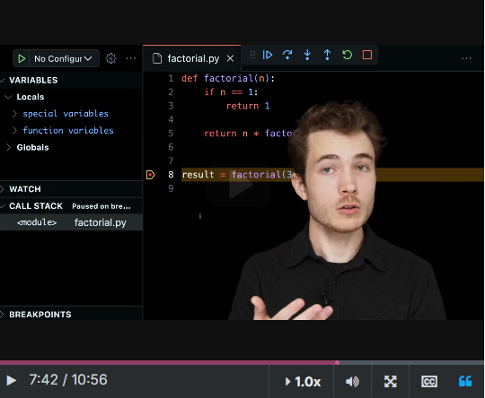

# Recursion Week 9 shorts

[Edx Short Recursion](https://learning.edx.org/course/course-v1:HarvardX+CS50P+Python/block-v1:HarvardX+CS50P+Python+type@sequential+block@1e2042142d3d4008a6b129c3c3f2a080/block-v1:HarvardX+CS50P+Python+type@vertical+block@664cad6297644d73bd80b52c305aa055)

## Arranging Cards

We have 3 set of cards.
Mathematically we have three places to put down these cards, one card for each slots.

Each time we place the a card the possibility of cards reduce by one.

A deck of cards have 52 cards, each time we place a card it reduce one possibility down, 52, 51, ...1, so we have 8.10 exp 67 changes.

n! n factorial, where n is any number and the factorial is a way of computing how many permutations or ways of arranging unique objects there are.

3! = 3 . 2 . 1 = 6 different ways of arranging object
2! = 2 . 1
1! = 1

And here we have a pattern, if we see it like this

3! = 3 . 2 . 1
     2! = 2 . 1
          1! = 1

3! = 3 . 2 . 1
     2! = 2 . 1!

3! = 3 . 2! then 3 factorial is three times 2!

This is what we call recursive definition. Using the solution to the problem in itself.

So we have this:
n! = n . (n - 1)!

We´re defining the solution to the problem in terms of slightly smaller problem but still one that is a solution to the problem as well.

### Example

´´´python
def factorial(n):
    if n == 1:
        return 1
    return n * factorial(n - 1)

def main():
    result = factorial(3)
    print(result)

if __name__ == "__main__":
    main()
´´´

### Notes

- if we define the factorial we  need to define a base case, a scenario where we know the answer off the bat.
- This scenario, or base case can indeed and the recursive.

## Using vscode debugging

We set a breakpoint and we run the debug in vscode, at the right we have a tab where we can see more information

Variables, and bellow we can see the call stack, that is the place where all of our functions calls are going to go.

Each time it finish it take it off the top of the call stack.

To go each step we use the arrow down that indicate step into, so we can see each iteration.
